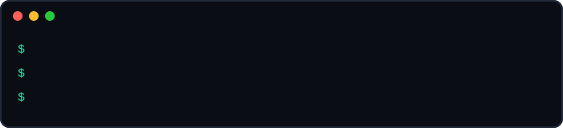
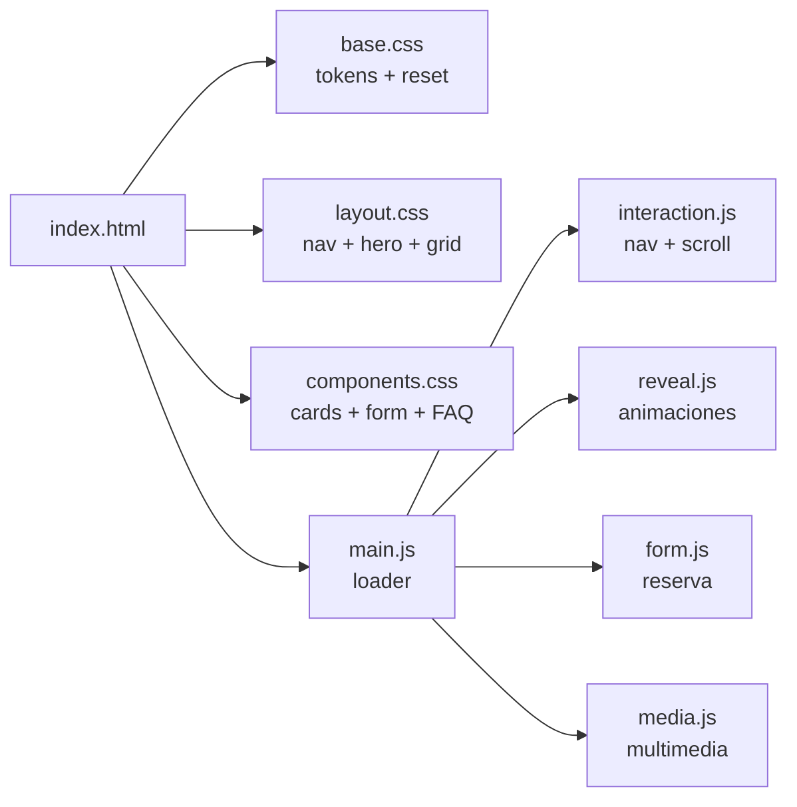

<div align="center">



<br>


<br><br>

**Landing page de restaurante gourmet — dark mode, Space Grotesk y layout fluido sin `max-width`.**

🔗 **[Ver demo online](https://htmlpreview.github.io/?https://raw.githubusercontent.com/javier-valle/taller-programacion-web/main/taller-programacion-web/index.html)**

</div>


## 📑 Contenido

| | | |
| :-- | :-- | :-- |
| [Características](#-características) | [Demo rápida](#-demo-rápida) | [Cómo funciona](#-cómo-funciona) |
| [Estructura](#-estructura) | [Evaluación](#-evaluación) | [Créditos y licencia](#-créditos) |

> 📜 Historial de avances: [`CHANGELOG.md`](./CHANGELOG.md) (Avance 1 entregado · Avance 2 en curso).


## 🍽️ Qué es

**La Casa del Sabor** es la landing page de un restaurante gourmet, desarrollada como proyecto para el curso **Taller de Programación Web (UTP)**.

Diseñada por **Javier Valle** con dark mode, tipografía **Space Grotesk**, layout fluido sin `max-width`, animaciones de scroll reveal y sistema de design tokens.

> [!NOTE]
> Proyecto académico — estado: **terminado / en evaluación**. Sin dependencias: solo HTML + CSS + JS vanilla.

<div align="center">

</div>


## ✨ Características

<table>
<tr>
<td width="33%" align="center" valign="top"><b>HTML semántico</b><br><sub>meta description, Open Graph, Twitter Card, canonical, viewport, favicon, <code>lang="es"</code></sub></td>
<td width="33%" align="center" valign="top"><b>CSS modular</b><br><sub><code>base.css</code> tokens + reset · <code>layout.css</code> estructura + nav · <code>components.css</code> cards, tablas, form</sub></td>
<td width="33%" align="center" valign="top"><b>JS modular</b><br><sub><code>interaction.js</code> · <code>reveal.js</code> · <code>form.js</code> · <code>media.js</code> · <code>main.js</code> loader</sub></td>
</tr>
<tr>
<td width="33%" align="center" valign="top"><b>Layout fluido</b><br><sub>sin <code>max-width</code> fijo, Grid + <code>clamp()</code>, responsive con <code>minmax()</code></sub></td>
<td width="33%" align="center" valign="top"><b>SVG inline</b><br><sub>todos los íconos en SVG con <code>stroke="currentColor"</code>, sin emojis en la UI</sub></td>
<td width="33%" align="center" valign="top"><b>Scroll reveal</b><br><sub><code>IntersectionObserver</code>, <code>fade-up/down/left/right/scale-in</code> + stagger, respeta <code>prefers-reduced-motion</code></sub></td>
</tr>
<tr>
<td width="33%" align="center" valign="top"><b>Navbar inteligente</b><br><sub>transparente → glassmorphism al scrollear, hamburguesa responsive con focus trap y Escape</sub></td>
<td width="33%" align="center" valign="top"><b>Hero secuencial</b><br><sub>entrada escalonada tag → título → descripción → CTA</sub></td>
<td width="33%" align="center" valign="top"><b>Reserva funcional</b><br><sub>formulario con validación JS, shake, estados inválidos y success temporal</sub></td>
</tr>
</table>

<table>
<tr>
<td width="50%" align="center" valign="top"><b>Chef + Multimedia</b><br><sub>Sección Nuestro Chef (foto, bio, badges de especialidades, premios) · Experiencia Visual con video YouTube, 3 tarjetas (música ambiente, Chef's Table, maridaje) + estadísticas · Audio ambiente vía CDN externo (Pixabay Night Jazz)</sub></td>
<td width="50%" align="center" valign="top"><b>SEO + Accesibilidad</b><br><sub>Open Graph, Twitter Card, canonical · <code>aria-label</code>, <code>aria-expanded</code>, <code>role="alert"</code>, <code>:focus-visible</code>, contraste AA · FAQ con <code>&lt;details&gt;</code> nativo y chevron rotatorio</sub></td>
</tr>
</table>


## 🚀 Demo rápida

**Requisitos:** solo un navegador moderno. No requiere instalación ni dependencias.

**Online:**

🔗 [https://htmlpreview.github.io/?https://raw.githubusercontent.com/javier-valle/taller-programacion-web/main/taller-programacion-web/index.html](https://htmlpreview.github.io/?https://raw.githubusercontent.com/javier-valle/taller-programacion-web/main/taller-programacion-web/index.html)

**Local (3 pasos):**

<div align="center">

</div>

```bash
cd taller-programacion-web
python -m http.server 8000
# abrir http://localhost:8000/index.html
```

> [!TIP]
> También puedes abrir `taller-programacion-web/index.html` con doble clic — funciona sin servidor. Usa el servidor local si el video/audio externo no carga por políticas del navegador.


## 🧭 Cómo funciona

<div align="center">

</div>




## 📁 Estructura

<details>
<summary><b>Árbol del proyecto</b></summary>

```text
taller-programacion-web/
├── index.html
├── README.md
├── readme-assets/
│   ├── banner.svg
│   ├── divider.svg
│   ├── flow.svg
│   ├── carousel.svg
│   └── terminal.svg
└── taller-programacion-web/
    ├── index.html
    └── assets/
        ├── css/
        │   ├── base.css         (variables, reset, tipografía, utilities)
        │   ├── layout.css       (nav, hero, grid, secciones, contenedores)
        │   └── components.css   (cards, tablas, botones, formulario, FAQ, multimedia)
        ├── js/
        │   ├── interaction.js   (nav, mobile, scroll, parallax, progress, whatsapp, highlight)
        │   ├── reveal.js        (animaciones de scroll reveal)
        │   ├── form.js          (validación y feedback del formulario)
        │   ├── media.js         (pausa de loops animados)
        │   └── main.js          (loader / inicializador)
        ├── images/
        │   └── lcs-logo.svg
        └── video/
            └── (videos locales)
```

</details>

## 🛠️ Especificaciones

| Campo | Valor |
| :-- | :-- |
| Proyecto | La Casa del Sabor — landing restaurante gourmet |
| Stack | HTML5 semántico · CSS3 modular · JavaScript vanilla |
| Tipografía | Space Grotesk |
| Tema | Dark mode, design tokens, sin `max-width` |
| Multimedia | Video YouTube embebido + audio CDN externo (Pixabay Night Jazz) |
| Versión | [TODO: definir versión, ej. 1.0.0] |
| Compatibilidad | Navegadores modernos (Chrome, Edge, Firefox, Safari) |
| Autor | Javier Valle (U24265511) — Taller de Programación Web, UTP |


## 📊 Evaluación

### Avance 1 — HTML + CSS base (entregado 21/04/2025)

| Criterio | Puntaje |
| :-- | :-- |
| Estructura y uso de HTML | 4 |
| Aplicación de CSS | 3 |
| Estructura de la página | 3 |
| Uso de formularios | 3 |
| Implementación de tablas | 3 |
| Integración de multimedia | 4 |
| **Total** | **20** |

### Avance 2 — CSS avanzado + responsivo (en curso)

| Criterio | Estado |
| :-- | :-- |
| Tipografía personalizada (Space Grotesk, Google Fonts) | ✅ en código |
| Íconos y vectores (35 SVG inline propios) | ✅ en código |
| Animaciones y transiciones CSS | ✅ en código |
| Diseño responsivo | ✅ en código |
| Maquetación con Flexbox/Grid | ✅ en código |
| Herramientas del navegador (evidencia DevTools) | ⏳ capturas/video |
| Presentación y organización general | ✅ en código |
| **Total** | **/20** |

> Detalle completo en [`CHANGELOG.md`](./CHANGELOG.md). Puntajes por criterio del Avance 2 por confirmar (el documento llega incompleto).


## 🆘 Soporte

[TODO: agregar medio de contacto — ej. email universitario o link a issues del repo].

- Reportar un problema: abre un issue en el repositorio con captura + navegador usado.
- Duda del curso: contactar al autor vía canal de la UTP.

## 🗺️ Roadmap (Avance 2)

- [x] Tipografía externa, SVG propios, animaciones, responsive, Flex/Grid
- [x] Fixes: favicon, `theme-color`, `og:image`, iframe diferido
- [x] PDF decisiones (`docs/DECISIONES-DISENO.pdf`) + ZIP base (`entrega-avance2.zip`)
- [ ] Capturas o video con DevTools (pasos abajo ⬇️) y re-comprimir el ZIP
- [ ] [TODO: confirmar fecha límite del Avance 2]

## 🤝 Contributing

Proyecto académico individual — no se aceptan contribuciones externas por ahora. Para cambios grandes, abrir un issue primero.

## 📌 Estado del proyecto

Académico UTP. **Avance 1** presentado en clase el 21/04/2025. **Avance 2** (CSS avanzado y diseño responsivo) en curso — ver [`CHANGELOG.md`](./CHANGELOG.md).


## 👨‍🍳 Créditos

Proyecto desarrollado por **Javier Valle (U24265511)** para el curso Taller de Programación Web — UTP.

Multimedia externa: video YouTube embebido + audio ambiente vía CDN de Pixabay (Night Jazz).

## 📄 Licencia

Copyright (c) 2026 **Javier Valle (U24265511)** — Todos los derechos reservados. Ver archivo [`LICENSE`](./LICENSE).

> Proyecto académico original para el curso Taller de Programación Web (UTP). Se permite visualizar y evaluar con fines académicos; no se permite copiar ni redistribuir sin autorización del autor.

<div align="center">
<sub>La Casa del Sabor · UTP Taller de Programación Web · Hecho con HTML + CSS + JS vanilla</sub>
</div>
